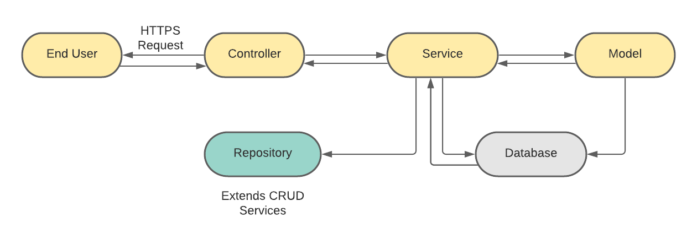

# portfolio-tracker
The application exposes certain endpoints to add/update/fetch/delete trades executed and the corresponding portfolio and returns.

# Requirements:
- Java JDK
- Maven
- IntelliJ IDEA

# Workflow Diagram: 


# Setup:
1. Clone the application
```
https://github.com/AarshiyaGuneja/PortfolioTracker.git
```
2. Create MySQL database (you can choose database of your choice - just the configurations for that database will be different)
```
create database databaseName
```
3. Change configurations of database (username and password) in application.properties file.
4. Build and package the application using Maven
```
mvn package
```
5. Run the application using command: 
```
java -jar target/PortfolioTracker-1.0-SNAPSHOT.jar 
```

The application will be up at localhost and on the port which is defined in application.properties file.

The application exposed below APIs:
```
1. Fetching all trades of all securities (GET): /trades 

2. Adding trades (POST): /trades 
You can below json format to add trade: 
    {
        "security_ticker": "ITC",
        "type": "B",
        "quantity": "50",
        "price": "60"
    }
    
3. Updating trades (PUT): /trades/{id}  (You have to pass the trade id to update that particular trade)

4. Deleting trades (DELETE): /trades/{id} (You have to pass the trade id to delete that particular trade)

5. Fetching portfolio (GET): /portfolio

6. Fetching returns (GET): /portfolio/returns
```
The application has been deployed on AWS:
> http://portfoliotracker-env.eba-rpuidbeq.us-east-2.elasticbeanstalk.com/
 
Append the above api endpoints to the hosted application url and the results will be shown.
